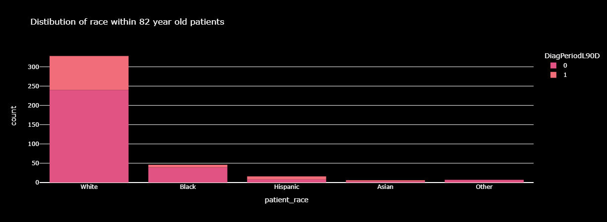

<h1>Predicting whether patients received metastatic cancer diagnosis within 90 Days of screening</h1>

# Table of Contents
- [Problem Statement](#Problem-Statement)
- [Data Preprocessing](#Data-Preprocessing)
- [Exploratory Data Analysis](#Exploratory-Data-Analysis)
- [Modelling](#Modelling)
  - [Model Selection](#Model-Selection)  
  - [Model Optimization](#Model-Optimization)
  - [Evaluation](#Evaluation)
- [Challenges](#Challenges)
- [Impact](#Impact)

<h3>Problem Statement</h3>
The goal of this project was to predict if patients received a metastatic cancer diagnosis within 90 days of screening. Metastatic breast cancer occurs when cancer spreads to more than one area, therefore it requires urgent and timely treatment.
 
<h3>Data Preprocessing </h3>

* Packages:- **Pandas, NumPy**
* The data had ~13000 rows and 88 patient, demographic and environmental features.
* To handle null values, I applied:
  * Mode - categorical features
  * Median - numerical features with outliers
  * Mean - numerical features without outliers
* Uninformative columns like id, gender (all patients were female) were dropped together with 2 features that had 99% of values being null.
* The model had imbalanced classes. The class 0 observations were oversampled using the RandomOverSampler package in order to balance the 2 classes and hence, improve model performance.

<h3>Exploratory Data Analysis</h3>
* Packages:- Plotly, Matplotlib
* To conduct the EDA, I used correlation matrices, scatter plots, histograms, pie charts and bar plots to visualise the relationships between the features.
* I observed that patients not receiving the metastatic diagnosis within 90 days often had a breast cancer diagnosis code of '1749'. Moreover, patients aged 82 commonly received this breast cancer diagnosis code.

<h3>Modelling</h3>
<h4>Model Selection</h4>

* Packages:- Scikit-learn, CatBoost, LightGBM, XGBoost
* Predicting metastatic diagnosis within 90 days (1 for yes, 0 for no) is a **binary classification** problem.
* The classification features had lots of unique values. Consequently, feature encoding techniques such as one-hot encoding would lead to a high dimension dataset.
* As a result, I narrowed down the classification models to CatBoost, LightGBM and XGBoost, as they are capable of handling categorical features, without requiring transformation.

<h4>Model Optimization</h4>

* Hyperparameter tuning - The Grid Search technique was used in order to find the best hyperparameter values for the models.
* K-fold cross-validation technique was also used to prevent overfitting, hence ensuring the model generalises well to new data.

<h4>Evaluation</h4>

* Evaluation metircs such as Precision, Recall, F1-score, Confusion Matrix and the ROC-AUC curve were used to evaluate the models.
* The XGBoost model, post hyperparameter tuning, was the best classification model!

<h3>Challenges</h3>

* The dataset was very imbalanced with class 1 having ~ 8000 observations and class 0, 4500~ observations. This was addressed by oversampling class 0 observations, improving AUC from 0.81 to 0.86
* The dataset had 88 features. Traditional feature encoding techniques would have resulted in a high dimension dataset that would have been computationally expensive to run. The solution was to use models that can handle categorical data without transforming them.

<h3>Impact</h3>

* The results of this project were to be used to aid medical experts to avoid unnecessary delays hence mitigating adverse effects of these difficult cancers.
* The models will also assist in detecting the relationships between patient demographics and environmental factors with the probability of getting a metastatic diagnosis within 90 days.
